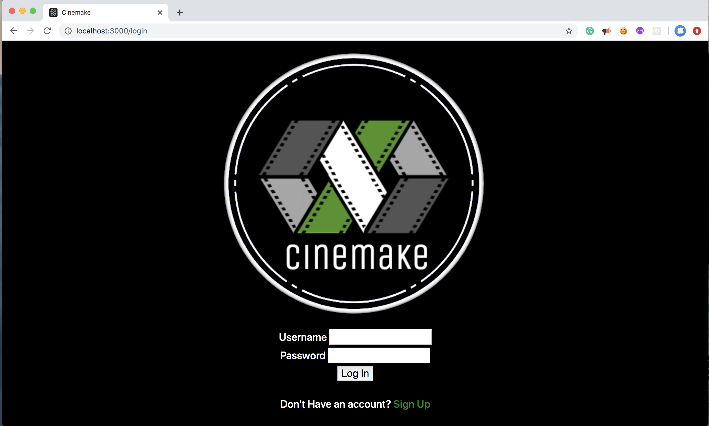
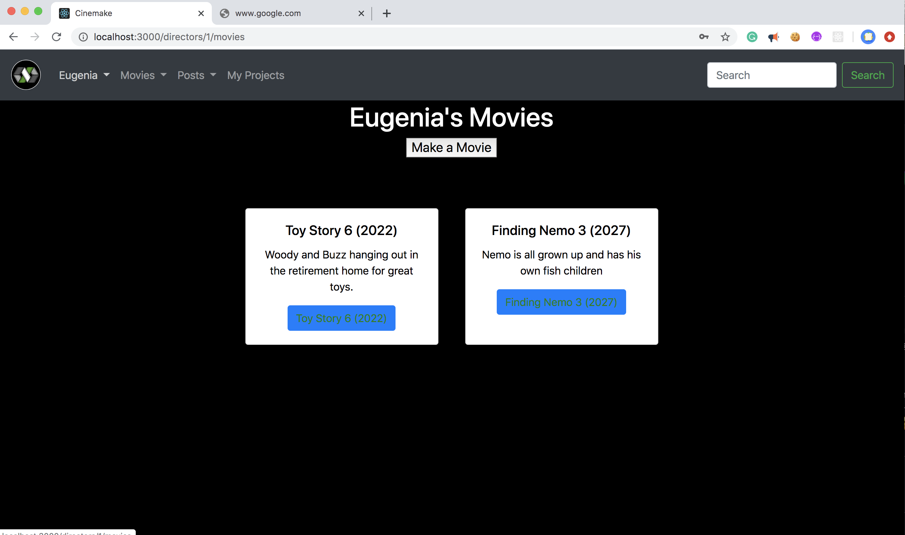
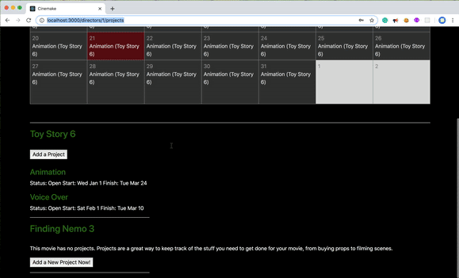

# Cinemake 

This project was started as a part of project collaboration with @wilfvernon as a part of our Mod 2 project while at Flatiron School. The original project repo can be found <a href="https://github.com/TheEugeniaKim/cinemake"> here </a>

## Purpose

A project management tool and social media collaboration space for movie directors, assistants, and crew members. Directors are able to login, create a new movie with different projects and schedule them. They are also able to friend other directors and connect, cast talent and crew, as well as set a budget for their projects. Additionally, they are able to write blog posts about their movies and projects throughout the process. 

I used this project to help me learn to create a Ruby on Rails App. 

Currently the app looks like this: 

However, going forward I would ask you to please ignore the erb view files as this app is going to be reworked with a new front end in the future. 

## Ongoing Plans for Cinemake 

This web application was built before I learned JavaScript and React. At the time the main goal was to build a tool that would enable me to learn Ruby on Rails and continue practicing making more complex domain models. 

Now that I've learned React, I plan to turn this repo into a backend. I hope to remake Cinemake with a React front end. Ideally this will look much more dynamic with an additional possibility of learning websockets in order to create more functionality enabling directors connect and chat with other directors. Additionally, I hope to make the director profiles 